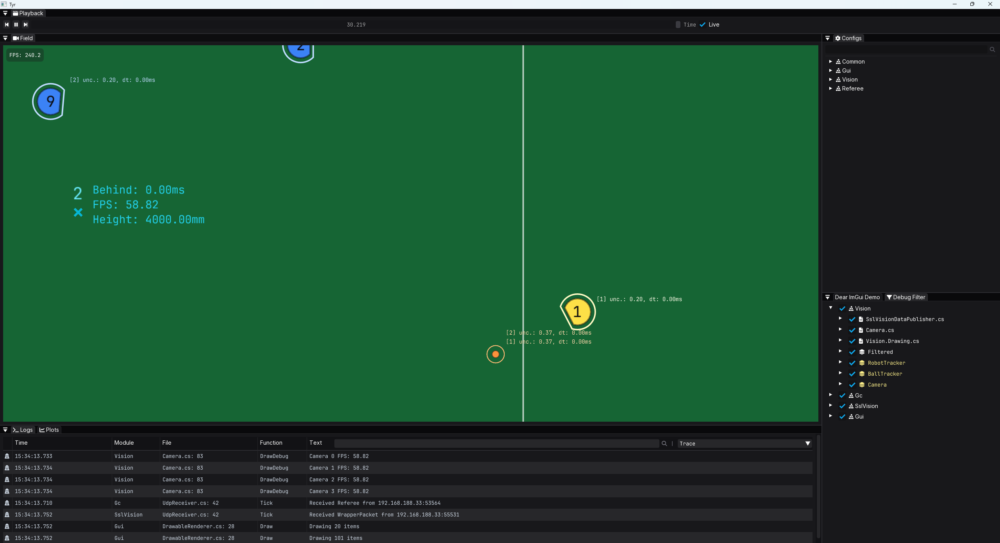

# Tyr: God of valor and justice
[](https://github.com/Immortals-Robotics/TyrSharp/actions/workflows/dotnet.yml)

Tyr is the robotics software stack powering Immortals, our RoboCup Small-Size League team. This is a modern C# 13 / .NET 9 port of our original [C++ codebase](https://github.com/Immortals-Robotics/Tyr).

⚠️ Work in progress, so far:

- ✅ Common, Vision, Referee, and GUI are done
- 🔜 Soccer is next



## Building

### Requirements
- .NET 9 SDK
- Rider or any IDE with C# support

### Steps
1 .Clone the repository
```bash
git clone https://github.com/Immortals-Robotics/TyrSharp.git
cd TyrSharp
```

2. Restore dependencies
```bash
dotnet restore
```

3. Build the solution
```bash
dotnet build
```

## Branching
We use [Github flow](https://docs.github.com/en/get-started/using-github/github-flow) as our branching strategy. Direct commits to the `main` branch are disabled, the goal is to keep it stable and usable.


### Workflow
1. Create a new branch from main named `dev/your-awesome-dev-task`.
2. Commit changes to your new branch.
3. Open a pull request when you're done. 
4. After your PR is approved and all checks are passed, merge it into the main branch.
5. Delete your dev branch.

## License
This project is licensed under the terms of the GNU GPLv3.
