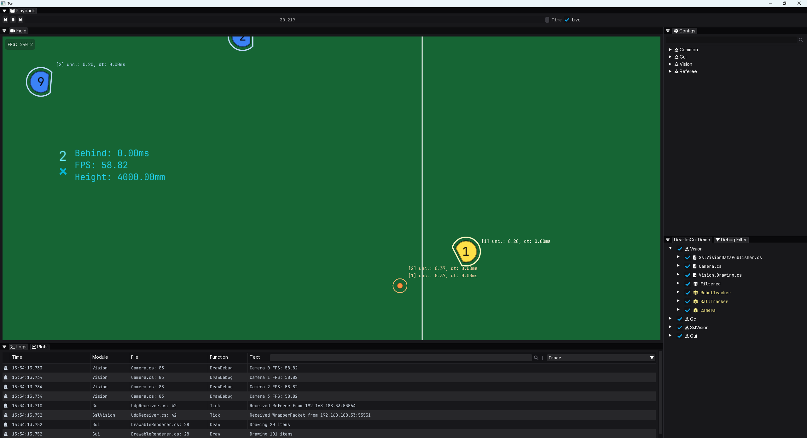

# Tyr: God of valor and justice
[](https://github.com/Immortals-Robotics/TyrSharp/actions/workflows/dotnet.yml)

Tyr is the robotics software stack powering Immortals, our RoboCup Small-Size League team. This is a modern C# 14 / .NET 10 port of our original [C++ codebase](https://github.com/Immortals-Robotics/Tyr).

⚠️ Work in progress, so far:

- ✅ Common, Vision, Referee, and GUI are done
- 🔜 Soccer is next



## Documentation

- [SSL Reference](Doc/SSL_REFERENCE.md) — RoboCup Small Size League rules, field specs, and the SSL-Vision / Game Controller / grSim communication stack.

## Building

### Requirements
- .NET 10 SDK
- Rider, Zed, or any IDE with C# support

### Steps
1 .Clone the repository
```bash
git clone https://github.com/Immortals-Robotics/TyrSharp.git
cd TyrSharp
```

2. Restore dependencies
```bash
dotnet restore
```

3. Build the solution
```bash
dotnet build
```

## Zed IDE

Project-local [tasks](.zed/tasks.json) and [debug configurations](.zed/debug.json) are included.

### Tasks

Open the task picker with `Ctrl+Shift+B` (or via command palette → `task: spawn`):

| Task | Description |
|---|---|
| `build: solution` | Build the entire solution |
| `build: <Project>` | Build a specific project (Common, Vision, Soccer, etc.) |
| `run: Gui` | Run the GUI with `Data/config.toml` |
| `run: Cli` | Run headless CLI with `Data/config.toml` |
| `test: all` | Run all tests |
| `test: filter` | Run tests matching a class/method name |
| `clean: solution` | Clean build outputs |

### Debugging

Requires the [zed-netcoredbg](https://github.com/qwadrox/zed-netcoredbg) extension. Open the debug panel and choose a configuration:

| Configuration | Description |
|---|---|
| `debug: Gui` | Build and debug the GUI |
| `debug: Cli` | Build and debug the CLI |
| `debug: Tests` | Build and debug the test suite |

## Branching
We use [Github flow](https://docs.github.com/en/get-started/using-github/github-flow) as our branching strategy. Direct commits to the `main` branch are disabled, the goal is to keep it stable and usable.


### Workflow
1. Create a new branch from main named `dev/your-awesome-dev-task`.
2. Commit changes to your new branch.
3. Open a pull request when you're done. 
4. After your PR is approved and all checks are passed, merge it into the main branch.
5. Delete your dev branch.

## License
This project is licensed under the terms of the GNU GPLv3.
